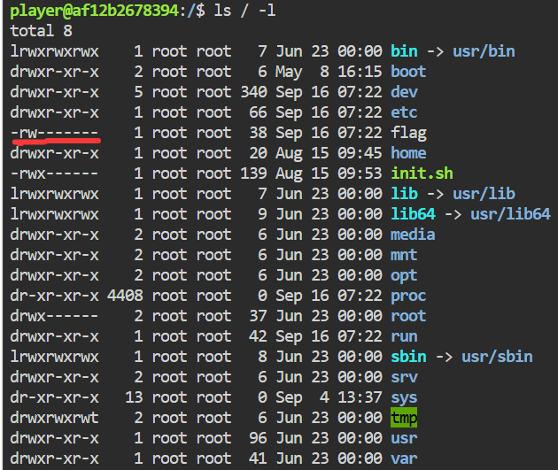
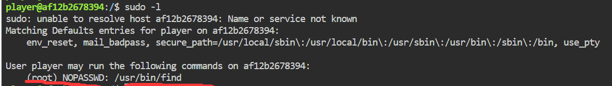

### 内网渗透与高级社工-权限提升维持-G1

#### 题目

你受雇对一家企业的内网服务器做渗透测试，甲方只给你开通了一个低权限账号，并表示这台服务器已按安全基线加固过。访问题目端口进入 Web 终端（用户 `player`），请设法取得 root 权限并找到 flag，完成本次渗透测试报告中"权限提升"部分的验证。

#### 没有权限查看

太简单了，直接给我们控制台权限！而且根目录下就有flag！

但是仔细看，输入`ls / -l`发现，flag文件的权限信息如下`-rw-------`。



什么意思，就是文件的所有者`user`才能读写它，同组`group`或其他人`other`均无读写权限。

```
权限信息通常由一串字符组成，例如drwxrwxrwx。这个字符串的第一个字符表示文件类型；
d代表目录，-代表文件。接下来的字符分为三组，每组三个字符，分别代表不同用户类别的权限：

第一组（2-4位）表示文件所有者（user）的权限。
第二组（5-7位）表示所属组（group）的权限。
第三组（8-10位）表示其他用户（other）的权限。

每组权限中的字符r代表可读，w代表可写，x代表可执行。
如果某个位置是-，则表示相应的权限未被授予。
```

#### 手动触发特权程序

这里教一种提权的方法，使用sudo提权。

一般sudo是需要密码的，但是Linux允许配置某些命令可以"免密码sudo"，输入`sudo -l`可以查看！



这题免密的命令是`find`，它可以帮助我们提权。

find本身只是一个文件查找命令，它有一个选项`-exec`，可以对每一个找到的对象执行指定命令。这个命令就包括`cat`查看内容。

最关键的是，如果find以root权限身份执行，那么`-exec`执行的命令也是以root权限身份执行的！这意味着咱们就可以去用cat访问需要root权限的flag文件！

Payload如下：

```bash
sudo find . -name "flag" -exec cat {} \;
```

解析一下：

- `sudo`超级管理员执行

- `find .`在本目录下查找（现在在根目录，根目录下有flag文件）

- `-name "flag"`查找过滤器为：名字为flag的对象

- `-exec cat`执行cat命令

- `{}`cat命令的占位符，find找到的每一个对象放在这

- `\;`给`-exec`选项中命令的闭合分号，`\`是转义

OK！

#### 运行/bin/bash创建子进程

`/bin/bash`是一个程序，它就是命令台本身。

原理相同，拥有root权限的find命令，执行`/bin/bash`时，创建出的子进程控制台，权限还是root。

payload:

```bash
sudo find . -exec /bin/bash \; -quit
```

解析：

- 不需要`{}`因为我们只需要执行`/bin/bash`它不需要任何参数，也和我们查到什么无关

- `-quit`找到一个就停手

执行后咱们就得到一个root权限的控制台了，想干什么都可以，直接`cat /flag`即可。

#### 防御策略：

严格管理免密sudo的命令，提高权限意识。
