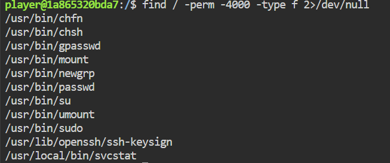
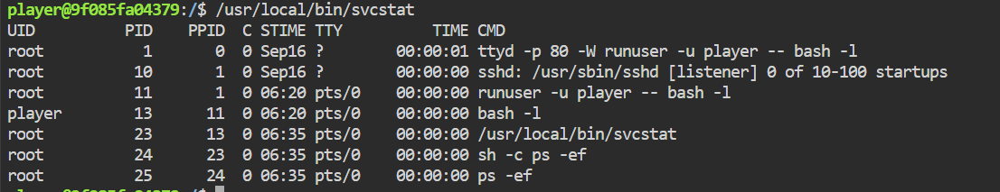
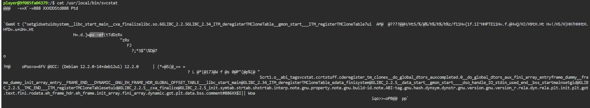
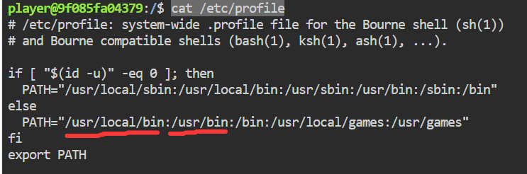

### 内网渗透与高级社工-权限提升维持-G2

#### 题目

你在一次红队演练中拿下了目标内网一台服务器的普通账号，任务书要求你必须证明能拿到这台机器的最高权限才算完成本次考核。访问题目端口即可获得该账号（`player`）的 Web 终端。请设法取得 root 权限，读取 `/flag`。

#### SUID的发现

同系列G1题目的方法被堵死了，输入`sudo -l`居然让我输入密码，那看来这是不行了。

那试试同样简单的`SUID`，输入`find / -perm -4000 -type f 2>/dev/null`：



前面几个都是系统自带的，没什么可疑的，拿去[GTFOBins](https://gtfobins.org/)搜索都没有什么作用！

但是最后一个`/usr/local/bin/svcstat`可能有问题，虽然拿去[GTFOBins](https://gtfobins.org/)搜索还是啥也搜不到，但是可以深入探索以下它的信息：

键入`ls /usr/local/bin/svcstat -l`查看相关属性，发现它的权限是`755`，表示它是一个可执行文件。按照`SUID`的配置，咱们执行它时会以root的权限执行！

键入`/usr/local/bin/svcstat`可以得到：



这些应该是正在运行的进程，`PID`是进程ID，`PPID`是进程的父进程的ID。
看向最后一条命令`ps -ef`，`ps`命令是Linux中查看正在运行的进程的命令，也就是说该回显是这条命令在发挥作用。`/usr/local/bin/svcstat`先调用了`sh -c`，然后`sh -c`又调用了`ps -ef`；

这里值得注意的是，`/usr/local/bin/svcstat`这个脚本它里面包含root权限的`sh`命令的调用。**如果我们能修改该脚本中使用`sh`命令的逻辑，就能以root权限执行任意命令，达到提权。**

#### 利用——PATH劫持

我键入了`cat /usr/local/bin/svcstat`，在里面确实发现了`ps -ef`的逻辑。



`vim`和`nano`两个文本编辑器均不存在，我又使用`sed -ir 's#ps -ef#cat /flag#' /usr/local/bin/svcstat`尝试修改却无打开temp文件的权限。
看来想要修改它本身是比较难了。

找到方法了！注意到脚本中写的`ps -ef`是单纯的相对路径；
而**Linux找执行命令`ps`时，如果不写命令的绝对路径，那么Linux就会按照`PATH`里的目录顺序遍历一次。直到找到叫`ps`的这个玩意，只看名字，且找到第一个就停手**！

`PATH`是一个环境变量，一般长这样：

```bash
PATH=/usr/local/sbin:/usr/local/bin:/usr/sbin:/usr/bin:/sbin:/bin
```

正确的`ps`命令在`/usr/bin/ps`这，只要我们在这之前的目录中（比如`/usr/local/bin`）塞一个同名的`ps`，那么linux就会执行我们恶意的脚本。

键入`cat /etc/profile`可以看到本机的PATH路径：



**但其实这无所谓~**
因为`PATH`路径是可以修改的。

下面直接放出payload：

```bash
echo 'cat /flag' >> /home/player/ps;
chmod 100 /home/player/ps;
export PATH=~:$PATH;
/usr/local/bin/svcstat
```

注，`~`就是当前用户的主目录，即`/home/player`

OK啦！

#### 总结：

提高防范PATH劫持意识，写高权限脚本时使用绝对路径。
