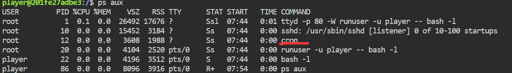

### 内网渗透与高级社工-权限提升维持-G3

#### 题目

你是某公司安全应急响应小组成员，一台内网服务器上报了异常但暂无更多线索，团队只给你开通了一个受限账号用于排查。访问题目端口即可获得该账号（`player`）的 Web 终端。请设法取得 root 权限，读取 `/flag`，确认这台机器的实际影响范围。

#### 定时任务

键入命令`ps aux`查看当前进程，发现了一个`cron`，它是监督周期性任务执行的命令：



**简单介绍一下`cron`：**

<u>它是一个常驻后台的进程</u>，**每分钟醒一次**，检查所有定时任务表，看有没有哪条到了该跑的时间，到了就以**指定的身份**执行。

<u>`cron`同时读以下几个地方的任务：</u>
`/etc/crontab`          ← 系统主表
`/etc/cron.d/*`         ← 每个文件一份，同格式
`/var/spool/cron/crontabs/<用户>`   ← 每个用户一份
`/etc/cron.hourly|daily|weekly|monthly/`  ← 目录，里面就是脚本

<u>正确观察追踪定时任务的姿势是</u>，去查执行日志，不可能去这些地方去一个一个翻找的！
日志在 `syslog` (或 `journal`) 里，格式如下：

```log
CRON[1234]: (root) CMD (/opt/backup.sh)
                ↑        ↑
             以谁跑    跑了什么
```

- 我去！这题在`/var/log/`中没找到`syslog`！

还有一计！我可以去看cron输出的邮件，当定时任务无回显时，默认会把结果以邮件的形式发送给root的邮箱，位置`/var/mail/root`。

- 完蛋了，`/var/mail/`中啥也没有！

#### 审计定时任务表

**任务表怎么看？**

`/etc/crontab`中主要内容如下：

```bash
# Example of job definition:
# .---------------- minute (0 - 59)
# |  .------------- hour (0 - 23)
# |  |  .---------- day of month (1 - 31)
# |  |  |  .------- month (1 - 12) OR jan,feb,mar,apr ...
# |  |  |  |  .---- day of week (0 - 6) (Sunday=0 or 7) OR sun,mon,tue,wed,thu,fri,sat
# |  |  |  |  |
# *  *  *  *  * user-name command to be executed
17 *    * * *   root    cd / && run-parts --report /etc/cron.hourly
25 6    * * *   root    test -x /usr/sbin/anacron || { cd / && run-parts --report /etc/cron.daily; }
47 6    * * 7   root    test -x /usr/sbin/anacron || { cd / && run-parts --report /etc/cron.weekly; }
52 6    1 * *   root    test -x /usr/sbin/anacron || { cd / && run-parts --report /etc/cron.monthly; }
#
```

它还给了我们一个格式，帮助我们看懂：这五个时间可以组成一个具体的时间判断条件。比如第一行，`17 * * * *`有效部分只有17分钟，意为只要分钟为17即执行，也就是每天执行24次，每个小时的第17分钟执行一次。
(如果是五个`*`，则是每分钟跑一次)

至于`||`符号的逻辑，补充说明一下Linux命令的技巧：
`||`意为`或`，是逻辑运算符，存在"短路效应"。即前一个条件为真，此时就满足了整个表达式为真的条件，所以后面的命令不会执行。
用在这里意为“<u>前面命令若正确执行，则不执行后面的命令；否则执行</u>”
`&&`同理！

**到此为止依旧废话，因为这个表中没有有价值的东西，全是系统自带的！**

正在的漏洞点在`/etc/cron.d/backup`中，这是一个定期打包目录为压缩包的脚本：

```bash
* * * * * root cd /var/backups/incoming && tar czf /var/backups/data.tar.gz * 2>/dev/null
```

属主是root；具体执行逻辑是：切换到`/var/backups/incoming`目录，打包该目录下所有文件为压缩包`/var/backups/data.tar.gz`，每分钟执行一次。

`/var/backups/incoming`是player**可写的目录**，也就是说，我们可以任意控制通配符查到的部分。

利用该定时任务的方法是**`通配符注入`**，通配符`*`会搜索整个目录中的文件名，填写到这条命令的对应位置中，拼成一个完整的命令后Linux才执行。
通配符只是把名字和原有命令拼起来，并不知道它拼的是参数，最终解析是靠Linux读命令；也就是说，如果把文件名换成命令的选项，而非参数，最终执行时也会发挥选项的作用。

**`--checkpoint=<num>`**是一个`tar`命令的选项，作用是每处理`<num>`次记录时就输出一次提示；相关的还有**`--checkpoint-action=<命令>`**，作用是每次输出一次提示时，就执行一次命令。

发挥以上两个选项的功能，咱们就可以从“向通配符处注入任意选项、名称”升级成“注入任意命令”，并且这种命令还是root权限执行的！

payload如下：

```bash
cd /var/backups/incoming;
echo 'cat /flag > /tmp/haha' > ha; #必须写一个脚本
#写在/tmp中，因为该目录默认人人可写可读
echo > --checkpoint=1; #不使用touch，防止被当成touch的选项
echo > --checkpoint-action="sh ha"; #因为这里不能出现/，会被当成路径
```

执行完后去`/tmp/`目录，等待0-59秒即可看到flag文件。
~~转发五个QQ群，然后看你的QQ等级~~！

#### 总结与防御建议

除了之前提到的”特权载体“，定期任务，也是一个提权/防范提权的重点；

对于定时任务或脚本中的命令，通配符谨慎使用。比如tar命令，建议不要在任意可写的目录中通配。
