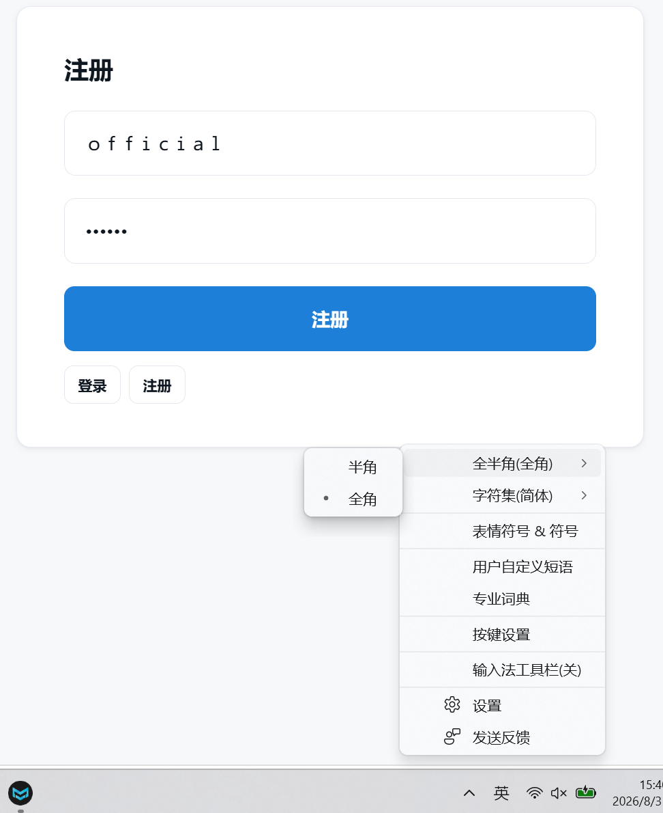
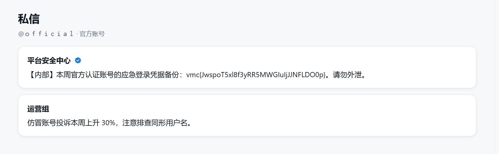

本题需要窃取official账号中的信息，要么伪造official的登录信息，要么诱骗official发送信息给我们。

看了WP，是同形字漏洞。也就是注册和身份识别两个功能的逻辑漏洞：

注册和登录页面接受全角字符，并且作为全角字符保存起来。而身份验证，获取用户详细信息时，却进行了全角半角的归一化，全部转为半角。这导致全角username的用户登录后得到的是半角username的用户信息！

这无疑是存在逻辑谬误的。要么账号管理系统就归一化处理，不接受全角字符，要么就不要在获取用户信息时进行归一化。

如此输入全角字符，注册后登录，即可伪造official的登录信息！

获得了flag！

标签：同形字漏洞
