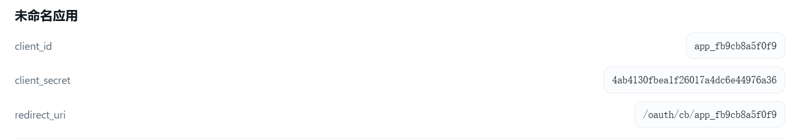
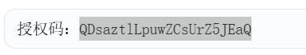
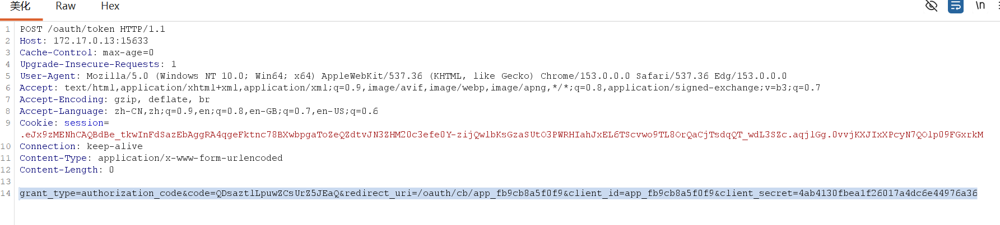
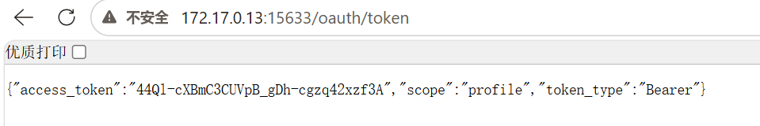
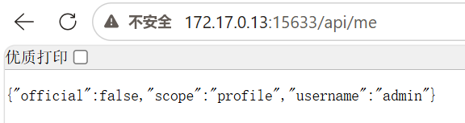
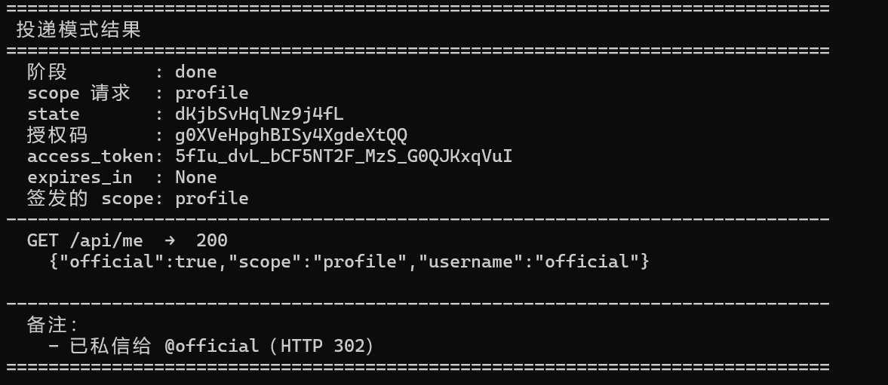
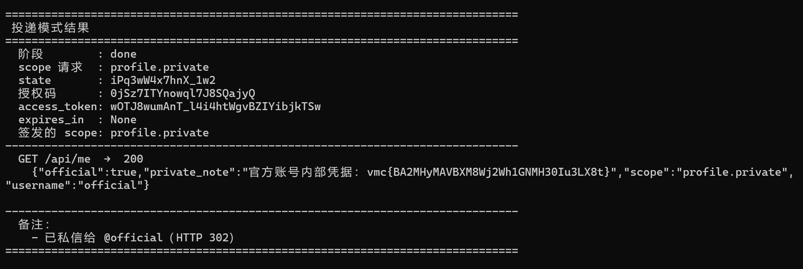

### 社会工程学G3——OAuth 2.0

#### 题目：

某社交平台的「开放平台」上线了应用接入能力，开发者可以创建 OAuth 应用，让用户用社区账号一键登录。平台鼓励开发者把应用体验链接私信给官方账号 @official，官方会登录试用并反馈。官方账号持有一份普通用户看不到的私密资料。请注册开发者账号，设法获取官方账号的私密资料。

#### OAuth服务存在——走一遍流程

地址栏输入路由`/oauth/authorize`可以得到响应`invalid client_id or redirect_uri`，这说明OAuth服务存在。

注册登录后，一键生成了一个OAuth客户端，获得了`client_id`、`client_secret`、`redirect_uri`信息。

现在让我们复刻学习文档的流程，**第一棒——应用向平台请求开启oauth服务**：
键入url：
`http://172.17.0.13:15633/oauth/authorize?response_type=code&client_id=app_fb9cb8a5f0f9&redirect_uri=/oauth/cb/app_fb9cb8a5f0f9&scope=profile&state=x8f2k1`

再回到咱们注册的应用中，发现真的获得了`authorize_code`，说明这里已经执行了：**第二棒——用户同意**和**第三棒——平台重定向发送授权码**！

咱们接着**第四棒——应用向平台兑换最终凭证**：
键入url：`http://172.17.0.13:15633/oauth/token`
得到回显`Method Not Allowed`，但是完全不慌，因为这一棒是要POST请求的，咱们使用BP抓包、再右键点开菜单、修改请求方法、并添加POST请求参数。
POST请求参数如下`grant_type=authorization_code&code=QDsaztlLpuwZCsUrZ5JEaQ&redirect_uri=/oauth/cb/app_fb9cb8a5f0f9&client_id=app_fb9cb8a5f0f9&client_secret=4ab4130fbea1f26017a4dc6e44976a36`

放行后就得到了传说中的`access_token`啦！

咱们最后跟到**第五棒——使用这个`access_token`**!
把这个玩意加在请求头中就能提高权限啦！
url键入`http://172.17.0.13:15633/api/me`
BP抓包，添加一行请求头：`Authorization: Bearer <token>`

完成啦！获得到了信息！可惜这个`scope`不是我们想要的类型，因此没有获取到很好的信息。

#### 纯天然利用链路

本题其实不涉及任何的OAuth的设计漏洞哈，本题的利用流程仅仅是：**把刚刚五棒中的第一棒让官方浏览器发送即可**。其他后续操作则完全一样。

这就是纯天然的原因，这个官方帮忙访问的接口是公开的，**好了！看我操作！**

<u>哦对了！`scope`也得认真考虑一下</u>。

当然我不会一个一个去尝试的！我直接让小肥鱼帮我写一个脚本，我先说说为什么脚本可行：
①全都是通过网络请求发送报文，python能发报文能解析报文；且返回信息要么是json格式，要么信息放在URL中（`authorize_code`），这些全都能被python获取。
②应用信息可定制，可被其他人复用，作为exp。

当然其中也有不方便的地方：
第四第五棒应用与平台联系时，需要带上cookie；因此需要检查，并提醒脚本使用者更新cookie。

然后咱再让AI提点意见：
比如`SCOPE` 做成命令行参数 / 配置文件，这个挺不错的欸。

我说错了，`authorize_code`虽然是放在url地址栏重定向回来的，但是在他人（如官方）授权时，那也是走他人浏览器的重定向。所以脚本`deliver.py`拿到本次授权码也得登录应用后台！
——没事，亲爱的小肥鱼特别聪明*！*

#### 脚本测试

按照README配置`config.json`文件和`deliver.py`中的`DM_DEFAULTS`数组，运行脚本`deliver.py`，发现给官方的链接没发出去，咱手动排查一下，不耗费token了。

检查完毕，AI搞错了POST请求的参数名称，我改回了`body`，再试试。

哦成了！

可恶的小肥鱼，没有给`deliver.py`做批量`scope`测试的功能（而`oauth_flow.py`又有），只能使用`-scope`命令行选项自己一个一个手动试！我也懒得编写了命令行脚本了，直接来吧。

键入命令：
`python deliver.py --scope profile.private`**哦这就可以啦！第二个就成了**！

那让我们再试试另一个拿自己做测试的玩意，看看小肥鱼写的对各项`scope`的价值分析如何？
键入命令：
`python oauth_flow.py --scope-file scopes.example.txt --delay 0.3 --json-out result.json`

服了，完全没有参考价值，那这个`deliver.py`暂时就当exp用吧！

本题完！

#### 总结：

就是学习OAuth的工作流罢了。漏洞没有学捏。

以后还会仔细学习OAuth的知识，这一块多钱的脚本应该没白花。。。
