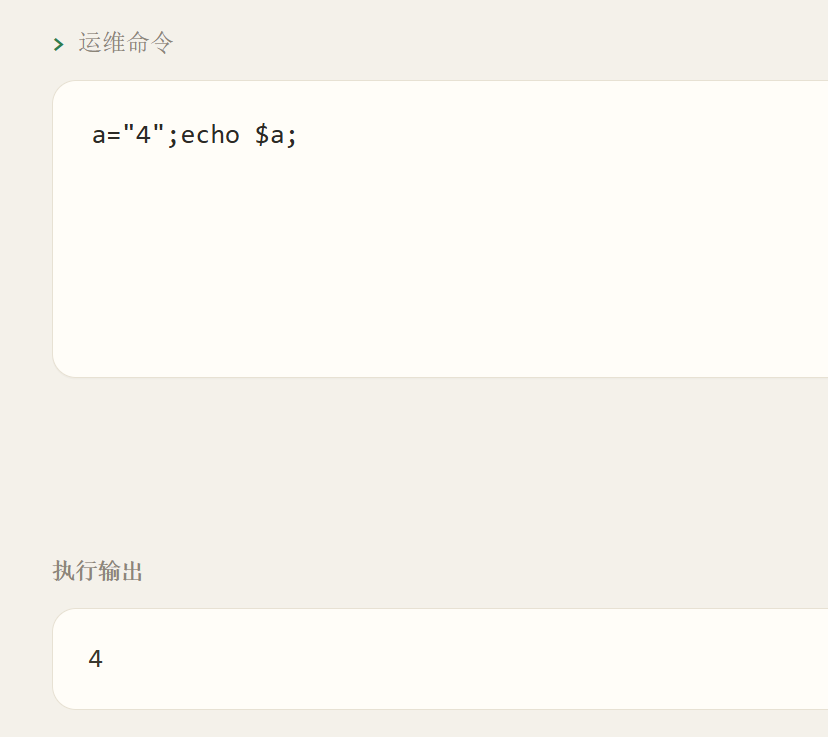

### 内网渗透与高级社工-终端EDR绕过-G1

#### 题目

目标主机部署了终端检测响应（EDR）代理，对运维面板下发的每条命令做命令行特征审计，命中恶意特征的命令会被实时阻断。你需要在不触发命令行告警的前提下执行命令，读取主机上的 `/flag`。

#### 黑盒测试呗

那这题就纯粹黑盒测试咯，各个角度测一下，看看作者编写特征审计的时候漏掉了啥？

黑盒测试离不开的，是**Fuzz测试**。

咱先看看变量能不能用，以及是否能同时执行多条命令：

看来是可以的！那我们就可以用变量名称来拼出一大堆敏感命令名称了！都不需要Fuzz测试。

#### 获取flag

键入`ls / -l`没被过滤，发现根目录下存在可读的flag文件！

不管它过滤了什么，咱们这么输入`a="ca";b="t";$a$b /fla?`，避免了`cat`和`flag`的出现。

没了！

#### 总结与防御建议

这只是一个简单的shell命令过滤绕过罢了，变量拼接是个好东西！

防御建议：**不要向外网随便暴露shell执行面板，不管如何过滤都是绝对的下策**。
