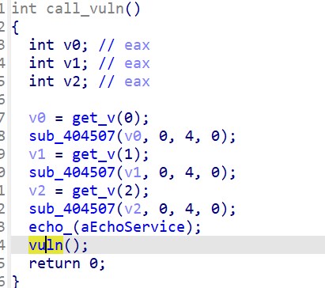
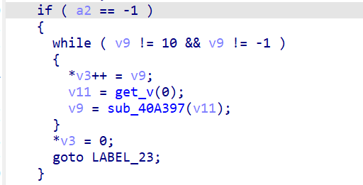
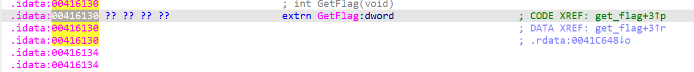

### 系统层漏洞利用与逆向分析-DEP数据执行保护利用-G1

#### 随便分析

题目要求分析运行在靶机上的一个exe文件，利用链路大概是：**"触发 get_flag() 函数以获取一次性凭证"**

咱们先用`nc`连接一下靶机吧！
连接后发现出现了一个输入点`Input`，输入的内容会被`Echo`回来！

那我们打开`ida`先找关于input和echo的逻辑。最后在`vuln`函数中找到了响应逻辑：

```c
int vuln()
{
  char v1[64]; // [esp+0h] [ebp-40h] BYREF

  sub_401110(aInput, v1[0]);
  sub_4063D5(v1);
  return sub_401110("Echo: %s\n", v1);
}
```

对`vuln`按下`X`进行交叉搜索，发现是图中函数调用的，我改名为`call_vuln`：



其中的`aEchoService`是一个字符串，内容是`Echo service`，也就是连接后的开场白，说明这个函数就是启动时调用的！对该函数按`X`，发现是`start`函数调用了它，哦！`Start`函数是程序的入口！

但是单看这个`start`，看不出什么东西！

关注到一个函数`get_flag()`，直接看是没有找到调用它的代码，**因此得想办法调用它**！

#### Ret2text

一个函数在被调用时，会在栈上压入记录返回地址`ret addr`；再压入`saved rbp`（旧栈帧，调用者的rbp）。`rbp`的含义是，记录属于该函数栈部分的起点，标记"**当前这个函数的地盘从栈上哪个位置开始**"。

需要记录旧栈帧的原因是，rbp作为一个寄存器，只存在一个，只能标记当前**正在执行的函数的栈起点**。 该函数是被其他函数调用的，那么它的调用者原先的rbp指针就应该被存起来。同理`ret addr`的部分，也是为了执行完该函数后，回到调用者函数上。

**`Ret2text`（return to text），就是利用栈溢出复写`ret addr`部分，使得函数结束运行时回调到指定的代码段，执行指定的内部代码。**

**举例：**

```c
void vuln(void) {
    char buf[32];      // 只有 32 字节
    gets(buf);         // 危险！不检查长度，读多少写多少
}
```

`vuln` 被调用后，栈（**地址从高到低增长**，所以图里上面是高位）大致是这样：

```
        高地址
    ┌──────────────────────┐
    │   ... 调用者的栈 ...   │
    ├──────────────────────┤
    │   返回地址 (ret addr) │ ← call vuln 时自动压入，8 字节(x64)
    ├──────────────────────┤
    │   saved rbp (旧栈帧)  │ ← push rbp 压入，8 字节
    ├──────────────────────┤ ← 新的rbp 指向这里
    │                      │
    │   char buf[32]       │ ← gets() 往这里写
    │                      │
    └──────────────────────┘ ← rsp 指向这里（buf 起始），rsp始终指向栈顶
        低地址
```

上述代码没有对buf进行长度检查，如果超过32字节，就会往高地址覆盖（小端存储），从而覆盖`ret addr`，完成漏洞利用！

因此，利用此漏洞的时候，最重要是算出偏移量，把要执行的代码段代码地址精准地注入到`ret addr`之中！

#### 回到本题！

上述的`vuln`函数中，未命名的函数`sub_4063D5`，从功能上看，就是一个获取字节存在`v1`之中的函数。跟进这个函数一路分析！

具体的代码分析也是眼花缭乱，交给ai帮我看，它说最有价值的是：



这里写成好读的代码是：

```c
if (maxlen == -1) {              // ★ a2 = -1 走这里！
        while (c != '\n' && c != EOF) {
            *p++ = c;                // ★★ 无长度检查，想写多少写多少
            c = fgetc(stdin);
        }
        *p = 0;
        goto done;
    }
```

实际上`v2`是`maxlen`的意思呀！这里`-1`就算是无界模式，想写多少写多少，那这旧达成了`ret2text`利用的条件了。**现在关键看：`vuln`中的`v1`，也就是写入的缓冲区，在栈上的位置，算出`ret addr`所需偏移**。

这点，在`v1`的注释中看到了：`// [esp+0h] [ebp-40h] BYREF`。`ebp/esp`就是32位模式下的`rbp/rsp`，说明了，栈结构如下：

```
        高地址
   ┌────────────────────────────┐
   │  返回地址 (4 字节)           │ ← [ebp+4]  ★ 我们要覆盖的目标
   ├────────────────────────────┤
   │  saved ebp (4 字节)         │ ← [ebp+0]
   ├────────────────────────────┤ ← ebp
   │                            │
   │  v1[64]                    │ ← [ebp-0x40]
   │                            │
   └────────────────────────────┘ ← ebp-0x40
        低地址
```

所以相对于`v1`的位置，`ret addr`的偏移应该是`64+4=68`。即向v1输入68个字节后，再拼接4字节的地址，就能复写`ret addr`！

我让AI按照这个思路，帮我写了一个python脚本如下.

哦对了！我们需要一路点进`get_flag()`函数，找到想要执行的代码的位置如图：



`0x00416130`，这是我们的目标！脚本在`/exp/exp.py`！

**纠正：这个地址不对，因为`GetFlag`是外部导入的，无法直接跳转代码段调用，只能跳转到`get_flag`的地址`0x00401000`**

AI帮我编写脚本时，总是curl不到flag，**他检查出来是时间的问题，因为token签名靶机比flag容器靶机快48秒**！最终解决办法是，晚48秒再兑换，所以调好脚本参数运行后，需要等待一段时间！

#### 总结与防御建议

总结下来这题我没有直接学习到DEP的知识，但是学到了一个利用栈溢出执行代码段任意代码的漏洞**`ret2text`**。一并学习到的还有**函数调用与栈帧知识**，OK。

防御此类漏洞的根本方法是，限制输入长度，也就是防止栈溢出。说起来，如果从汇编角度看，**一切的缓冲区溢出都应该被注意**！
