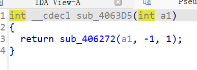
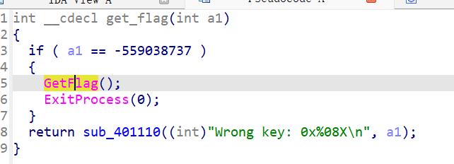
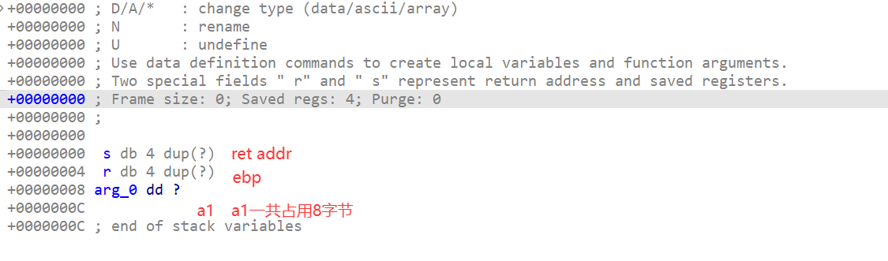

### 系统层漏洞利用与逆向分析-DEP数据执行保护利用-G2

#### 同样的架构！

这题的程序架构和上一题一模一样，跟进到`vuln`函数后，可以看到：

```c
int vuln()
{
  char v1[128]; // [esp+0h] [ebp-80h] BYREF

  sub_401110(aInput, v1[0]);
  return sub_4063D5(v1);
}
```

缓冲区`v1`大小128字节，就在`saved ebp`下面；`sub_401110`是一个提示输入的命令；`sub_4063D5`是熟悉的写入缓冲区函数，并且最大长度依旧设置为了`-1`。



这是否意味着又可以使用缓冲区溢出到`ret addr`中，利用`ret2text`漏洞了？

#### flag函数的变化

`get_flag()`函数引入了参数`a1`，要`a1`为一定值才能通过检测，顺利执行——那我们直接把代码地址ret到调用函数`GetFlag()`不就可以了！？



然而`ret2text`还得看偏移计算，已知缓冲区就在`ebp`下面，而32位应用中，`ebp`32bit一共4字节，所以偏移是`132`。

我尝试使用G1的脚本修改参数，发现不行，说明上述分析错误！

**`GetFlag`是外部导入（粉色），你无法直接`ret`到他的代码位置！**
*——为什么G1可以呢？*（已纠正！）

**那我尝试发送`a1`参数（待会讲），return到`get_flag()`函数的起点试试呢？**

在`Functions`列表中能够看到`get_flag()`的代码段起点！
点击跟进`a1`参数，得到以下信息：



这个说明了参数和ebp的关系，咱们直接看汇编代码会更好！

```assembly
arg_0= dword ptr  8
push    ebp
mov     ebp, esp
cmp     [ebp+arg_0], 0DEADBEEFh
jz      short loc_40101F
```

再`vuln`函数执行完毕，他最后会对`ret addr`执行`pop eip`，程序跳转到上述`push ebp`这一栏，因此执行完这一句后`esp`指向的就是`vuln`函数栈帧中`ret addr`的地址。此时下一句`mov ebp,esp`就说明了`a1`相对于`vuln`函数栈帧中`ret addr`的地址`+8`。

根据以上分析，那我们的计划是:

偏移为0开始132个字节随便填充；
偏移为132开始4个字节填充`get_flag()`起点位置`00401000`；（`ret addr`）
偏移为136开始4个字节随便填充；
偏移为140开始4个字节填充`a1`要求的数据`0DEADBEEFh`；

我复用一下G1的脚本，修改一下payload即可，位置`exp/exp.py`

嗯可以！配置好靶机地址，直接`python exp.py`即可。

#### 总结与防御建议

也不算新知识，也还是函数栈帧的主题；本题也就是把流程分析更细化了，细化到了一句汇编指令的级别上。

防御建议，漏洞点依旧是`ret2text`，还是需要重点关注各种形式的溢出！
