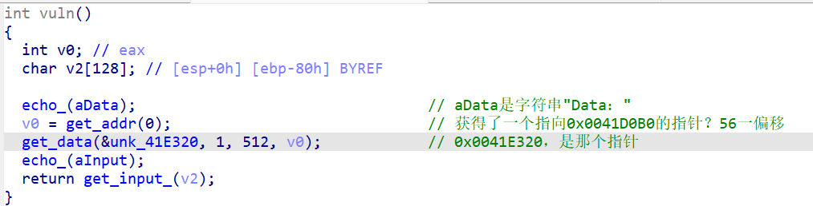
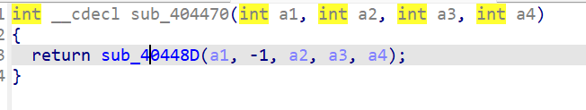
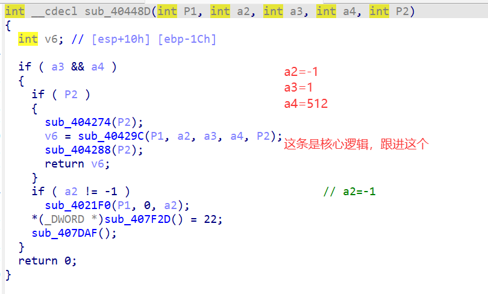
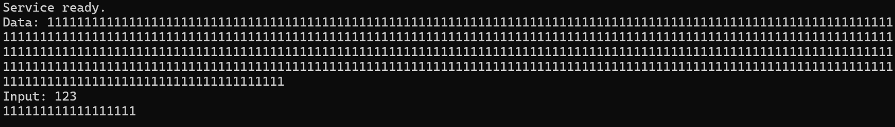

### 系统层漏洞利用与逆向分析-DEP数据执行保护利用-G4

#### 随便分析

这题还是逆向，分析程序，**触发 get_flag() 函数以获取一次性凭证**。

我第一时间尝试连接公共靶机，发现比G1多了一个`DATA`的输入会话，没有回显和`Input`的输入点了。

但是我打开ida，发现这次的应用其实和本课题G1的题目类似，可见获取`DATA`和`Input`的逻辑：

鉴于直连测试发现只询问了`DATA`，咱们先跟进它的逻辑，我标注为`get_data`的函数。

#### 分析DATA

点一下，得到：

再跟进，得到；

继续跟进，得到一串很长的函数！

**把这段函数喂给AI**，让他帮我分析！结果如下：

*这段代码我认出来了 —— **这是 MSVC 的 `fread_s`**
`fread_s(p1, -1, 1, 512, p2)` ≡ `fread(p1, 1, 512, p2)`
**会往 `p1` 写入最多 512 字节，且完全没有任何边界检查。** `a2 = -1` 把 `fread_s` 唯一的"安全"价值给废掉了 —— 如果`p1`是个小栈缓冲区，这就是一个**可写 512 字节的栈溢出**。*

**所以**，`a2`应该是`fread_s()`中的"缓冲区真实长度"，它设置为`-1`，也就意味着是`0xFFFFFFFF`，那么就不会报错，无限向`P1`指向的缓冲区写入数据。

而`P2`，则是来源，即`fread`是**从`P2`指向的缓冲区搬到`P1`**。`P2`实际上是`FLIE*`类型，指向一个file流对象。

`P1`，也就是目标地址是`0x0041E320`（数据段`.data`）。这个地址后到下一个变量起始地址`0x0041E520`刚好是512字节，**因此此处的DATA输入并无缓冲区溢出的风险**。

#### 缓冲区溢出

我使用`ncat`连接靶机，尝试输入512字节的数据，结果过了`DATA`这一关，来到了`Input`的输入点，这说明`get_data`函数结束了。

那么再看看关于`v2`的输入函数，最终发现还是把最大输入限制设置为了`-1`，依旧没有输入长度限制，**存在缓冲区溢出风险**。

并且既然已经走到了输入`Input`这一步了，输入的目标`v2`在`vuln`函数的栈帧中，位置`ebp-80h`，缓冲区大小128字节——**那么只需要输入132字节任意数据+4字节`get_flag`的起始地址即可！**

我依旧套用原来AI给我们写的脚本，产物`exp/exp.py`。配置好token靶机和flag靶机后，运行`python exp.py`即可。

#### 总结与防御建议

AI还是太好用了！因为我现在看逆向代码，还是很容易晕的，大多数是靠逻辑猜出功能，再慢慢确定细节。

防御建议仍然是：**关注一切溢出、用户输入的限制长度应该与缓冲区大小匹配**！
