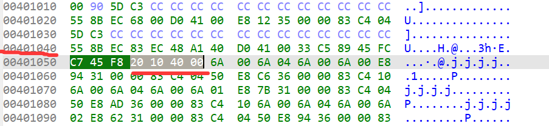

### 系统层漏洞利用与逆向分析-GS缓冲区安全检查利用-G3

#### nc连接看看

nc连接后让我`Enter your name`，和之前题目不一样了。随便输入就返回`No Winner`。

但是无所谓，咱们`Shift+F12`从字符串的角度寻找一下线索！

在`String`视图搜索`enter`，找到上述字符串，按`X`搜索引用，最终导向了这个函数：

```c
int sub_401040()
{
  int v0; // eax
  int v1; // eax
  int v2; // eax
  char v4[64]; // [esp+0h] [ebp-48h] BYREF
  void (*v5)(void); // [esp+40h] [ebp-8h] BYREF

  v5 = (void (*)(void))sub_401020;
  v0 = sub_4041F8(0);
  sub_404733(v0, 0, 4, 0);
  v1 = sub_4041F8(1);
  sub_404733(v1, 0, 4, 0);
  v2 = sub_4041F8(2);
  sub_404733(v2, 0, 4, 0);
  sub_401130("Buffer @ %p\n", v4);  //echo
  sub_401130("Fn ptr @ %p\n", &v5);
  sub_401130(aEnterYourName);
  sub_406605(v4);  //input
  v5();
  return 0;
}
```

从`sub_401130("Buffer @ %p\n", v4);`可以看出，`v4`就是一个字符串，但是这里打印的是`v4`**所处栈上的地址**，不进行解析。并且`char v4[64];`说明它是一个局部变量，长度64字节。

同理`v5`是一个指针，`sub_401130`是一个打印字符串函数，这里打印的是`v5`指针**所处栈上的地址**。打印结果`v4`是`0x0019FEE0`，`v5`是`0x0019FF20`刚好差64字节！

`sub_406605`还是那个读取用户输入到缓冲区的函数，并且点进去看，最大长度还是`-1`，也就是**还没解决缓冲区溢出问题**！

注意到，`void (*v5)(void);`说明实际上`v5`是一个**函数指针**；开头的`void`声明函数类型，后面括号中的`void`声明函数参数和类型。
所以`v5 = (void (*)(void))sub_401020;`这句，就是给它赋值。点进去发现直接`return sub_40453F(aNoWinner);`。`aNoWinner`字符串的内容就是`"No Winner"`，`v5();`应该就是指针调用的`sub_40453F`，打印出了相应的字符串。

#### 缓冲区溢出覆写函数指针

不用想都知道了，通过写`v4`覆写`v5`，就能任意调用函数。

光看C语言没用，咱们回到汇编，看看底层识别的是什么？

是`mov [ebp+var_8], offset sub_401020`，**而`offset+函数名`则是获得这个函数（的开头）在代码段（其实是所处段）中的偏移。**（~~请忘了这句，这句在汇编编程中没错，但在Ida这是不对的~~）

而关于`get_flag()`偏移的获取，它的起始地址是`0x00401000`。
32位exe中`ImageBase`（文件加载基址）默认是`0x00400000`；
而段的相对虚拟地址`RVA`必须是页的整数倍，默认`0x1000`，这里代码段的`RVA`就是`0x1000`，紧接着PE头后第一个页。
`0x00401000`是虚拟地址，上面说的都是虚拟地址，**`VA=ImageBase+RVA`**。而`OFFSET=VA-段起始VA`，这里也就是**`0`**?!

**原因找到了！**

**`Ida`中的`OFFSET`和汇编语言里面的`OFFSET`不一样！在汇编语言中`OFFSET`纯粹就是一个标识符号，在编译的时候，编译器会去确定这个值是多少，然后换成立即数编译！**



**这张图片中，把前两行丢给AI翻译一下，就是开头到给`v5`赋值的一句，其中`0x00401020`就是汇编视图中的`OFFSET`。**

所以很简单了，`v5`写进`0x00401000`即可，这是`get_flag`的地址。

<u>具体实现是，先填写64个随便字节，再写`0019FF00`</u>。

好的，让我们再次利用之前的脚本修改一下！

成果`exp/exp.py`，进入文件中修改好token靶机和flag靶机，直接`python exp.py`即可。

#### 总结与防御建议

C语言仅看逻辑，汇编才能看到二进制上的细节！

其实汇编也会骗人，必要时上二进制确认！

另外我发现用`string`找线索真的很爽！

防御建议的话，还是防范任何形式的溢出。
说的具体一点是，**限制长度要和缓冲区大小匹配**。
