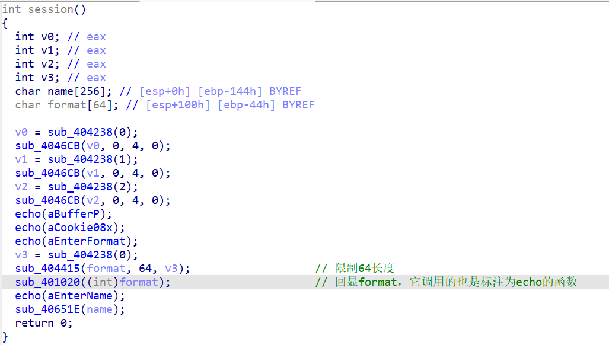

### 系统层漏洞利用与逆向分析-GS缓冲区安全检查利用-G4

#### 直连测试

直接连接token靶机，随便输入了一下，得到了以下结果：

```
Buffer @ 0019FDE4
Cookie : 636CD074
Enter format: 111
111
Enter name: 111
```

依旧按`Shift + F12`，通过字符串视图追踪到核心函数：



可以发现`format`做了长度限制，无溢出风险。但是处理`name`的函数`sub_40651E`的长度限制还是`-1`，依旧存在溢出风险！

#### 汇编视图

最终落到汇编视图：

```
lea     eax, [ebp+name]
push    eax
push    offset aBufferP ; "Buffer @ %p\n"
call    echo
```

这里说明回显的地址，是`name`在栈上的地址`ebp - 144h`。因此`ebp`可算！

```
mov     ecx, ___security_cookie
push    ecx
push    offset aCookie08x ; "Cookie : %08X\n"
call    echo
```

这里说明，`cookie`就是打印的cookie内容。当然`cookie`是要动态获取。

```
mov     eax, ___security_cookie
xor     eax, ebp
mov     [ebp+var_4], eax
...
mov     ecx, [ebp+var_4];var_4=-4
xor     ecx, ebp        ; Cookie
call    @__security_check_cookie@4 

cmp     ecx, ___security_cookie;这是call函数的核心判断
```

这里说明，写入`[ebp-4]`的内容，就应该是`cookie xor ebp`。

——那这题一脉相承确实又没啥变化！

#### 构造payload

可写的是`name`（256字节）；
往上有`format`（64字节）；
往上有`cookie`（4字节）；
再往上是`saved ebp`和`ret addr`（4+4字节）；

那就很简单了，对`name`写入：
**256+64=320字节任意数据+4字节`cookie xor ebp`+4字节任意数据+4字节`get_flag`地址**

这个长得像G1，我直接拿那题的脚本自己修改下！

修改好了！位置`exp/exp.py`，配置好token靶机和flag靶机后，直接`python exp.py`即可。

哦！第一次我忘了他要回复两次靶机，第一次输入的`format`我就乱输入即可。

#### 总结与防御建议

这几题都比较公式：

总结：字符串追踪、汇编视图、cookie的作用

防御建议：关注一切形式的溢出，用户输入限制长度应该与缓冲区大小匹配。
