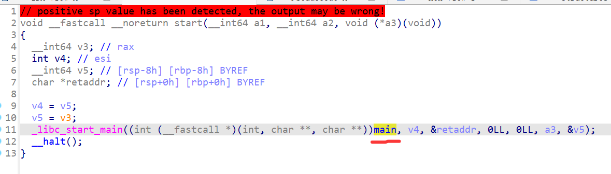
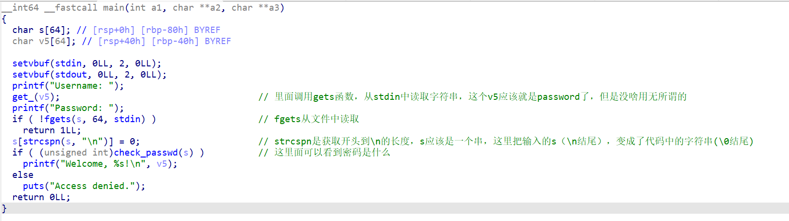
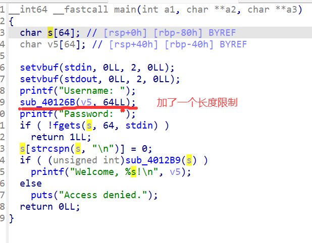

### 系统层漏洞利用与逆向分析-安全补丁对比分析-G1

#### 早期版本分析

本题给了两个`.elf`文件，不知道flag会以什么形式出现，咱们先打开早期版本看看它是干什么的！

进入`v1`版本，看`Exports`可以发现程序暴露的入口点是`start`，咱们跟进看看。

`start`调用了`main`函数。

分析结果如下：

看来`main`只是一个检查登录的程序，未见flag逻辑。

代码段，位置`0x004011D6`（省略高位8个0）开始，是一个直接获取flag的函数，看来就需要将程序跳转到此处了！

之前常用的`ret2text`，咱们看看行不行？关键是有没有溢出。

- `s`缓冲区使用`fgets`函数，明确指定了maxlen为64，不行！

- `v5`缓冲区使用的`gets`函数，是从stdin中读取"一行"，无长度限制，可以！

再分析一下栈帧结构：`char v5[64]; // [rsp+40h] [rbp-40h] BYREF`，说明`v5`写满64字节后将会溢出到`rbp`和`ret addr`；注意，这是64位程序，`rbp`和`ret addr`应该是8字节(16个16进制数字)。

哦对了！必须让`main`顺利结束，才能顺利跳转`ret addr`，所以密码要输入对：`xK9!mQ#2vL@pR7nZ`（点进`check_passwd`看）

#### 直连靶机尝试

咱们直接让AI写一个！

我告诉AI：留出填写靶机IP和PORT的位置，第一次发送72字节任意数据+8字节的`0x00000000004011D6`，第二次发送`xK9!mQ#2vL@pR7nZ`。

产物`exp/exp.py`，填写好靶机信息后，直接`python exp.py`即可。

#### 看看V2版本

进入可以看到最大的区别就是：

#### 总结与防御建议

这里都是C库函数，去百度一下就很容易找到线索。另外就还是老生常谈的`ret2text`了。

防御建议还是：防范一切形式的溢出，用户输入限制长度与缓冲区大小匹配。

