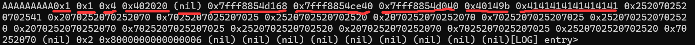
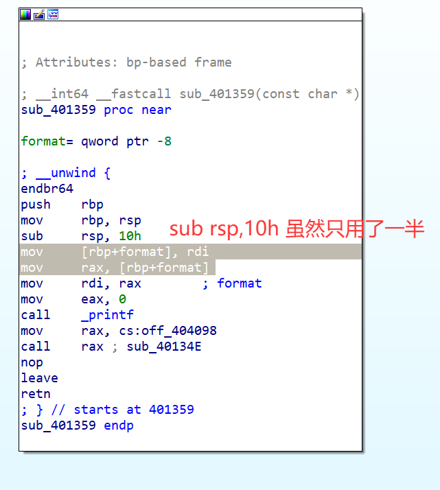
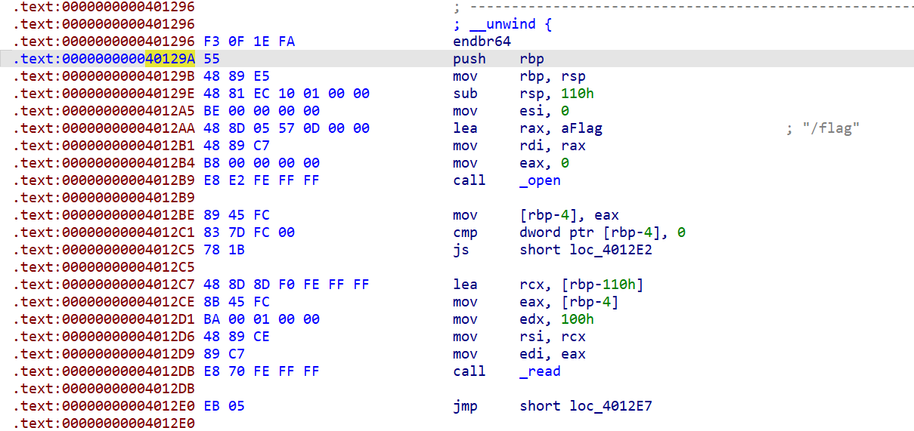

### 系统层漏洞利用与逆向分析-安全补丁对比分析-G2

#### 早期版本

看`Export`，主入口`start`；而后`start`调用了`main`——大概是这么个逻辑！

看向`main`，分析结果如下：

```c
__int64 __fastcall main(int a1, char **a2, char **a3)
{
  setvbuf(stdin, 0LL, 2, 0LL);
  setvbuf(stdout, 0LL, 2, 0LL);
  puts("audit-log v1.0 -- enter log entries (empty line to quit)");
  while ( !feof(stdin) )                        // feof用于检测文件流是否已到达文件末尾
    print_input();                              // 这是一个连续输入并输入一句回显一句的程序！
  return 0LL;
}

char *print_input()
{
  char *result; // rax
  char s[512]; // [rsp+0h] [rbp-200h] BYREF

  printstr_log();                               // 打印字符串'log'
  printf("entry> ");
  fflush(stdout);                               // 刷新数据缓冲区
  result = fgets(s, 512, stdin);                // 有输入限制
  if ( result )
  {
    s[strcspn(s, "\n")] = 0;                    // 输入转字符串规范
    if ( (unsigned int)sub_401386(s) )          // 判断：指针存在并且指向内容非空
    {
      ++dword_4040BC;                           // 这是一个神秘的全局变量，按功能来看，应该是行数
      return (char *)sub_401359(s);             // 打印字符串s
    }
    else
    {
      return (char *)printstr_line();
    }
  }
  return result;
}
```

这个程序没有缓冲区溢出风险。我去找了其他地方，居然连flag相关逻辑都找不到！？

#### 连接靶机

`ncat`连接靶机，功能和我们分析的差不多。

我尝试输入超过512字节的内容，发现它把输入内容按512切片，然后分多次回显出来了！ 

#### 分析v2版本——利用思路

v2版本的差别在于输出函数，比如在早期版本是，打印`printf(s)`换成了`printf("%s", a1);`。——没错，这是一个经典的`printf`使用错误！

问题是，在之前的学习中，格式串漏洞一般用于溢出读。这里只有这一个漏洞点的话，如何做到覆写`ret addr`呢？

---

我询问了AI，它的回答是：**依靠`%n`**。

**它是将当前已输出的字符数量写入对应的 `int*` 指针变量中**，也就是取参数作为地址，把`%n`占位符出现的地方前面的字符数量写进指针指向的地址中。

注意，64位下`print`可变参数有一个参数默认获取的参数槽，32位的没有这个特色，AI说是"**x86-64 System V ABI 的整数传参规则**的特色"：
核心是**前几个可变参数走的是寄存器，而非栈**，至于有几个参数走的是寄存器，这需要自己实际测量一下。

---

##### 分析可变参数和栈帧

测量方式是，输入如`AAAAAAAAA%p %p %p %p ...`这样的格式串；查看输出，找到出现`0x4141414141`的地方，再根据栈结构推导，请看这题的例子：



这是输入结果，可以看到`0x41414141`前有9个`%p`，也就是`8*9=72`个字节，再让我们分析一下栈：

`sub_401359`是调用`printf(s)`的函数，它接受一个参数`a1`(char* 类型)，那么我们来分析一下栈：
`printf ret addr`——8字节  <--调用前未见push
`sub_401359 调用printf之前的rsp预留空间`——8字节 **<--print参数从这里开始读**
`sub_401359 参数a1`——8字节  <--用于传参，详见汇编视图
`sub_401359 saved rbp`——8字节 
`sub_401359 ret addr`——8字节  <--调用前未见push
`print_input s`——512字节
`print_input saved rbp`——8字节 <== **print_input rbp**
`print_input ret addr`——8字节

关于上述汇编视图的分析，以下图片就明确了：



分析结果是，到`print_input s`这个输入缓冲区，也就是会出现`0x41414141`的地方，此前有4个8字节，即4个参数。`9 - 4 = 5`**说明走寄存器的可变参数有五个，是前五个**。

再根据此栈分析结果，**咱们写入的目标，应该是`sub_401359 ret addr`（第九个槽）。**

关于`flag`的线索，ida没有识别出获取`flag`的函数，但是可以找到在`0x40129A`，如图：



##### 回到%n本身

**`%n`是取参数的值作为地址，并写到参数指向的地址上；而不是直接写到参数上。
因此需要构造一个指针槽——该指针指向第九个槽的地址（栈的地址）。**

那么怎么获得栈地址呢？上述栈帧分析中，可以发现：第八个槽是`sub_401359 saved rbp`，它是`print_intput rbp`。`print_input rbp - 208h = sub_401359 ret addr`。
对，这样就算出来了。

或者用`sub_401359 参数a1`，它记录缓冲区`s`的栈地址，`s - 8`也是一样的。

##### 最后一个问题

现在的思路是`抓槽7内容、写槽9地址`，那么谁来做槽9地址的存放器呢？

答案是`s`缓冲区。整体链路是：

①抓取槽7内容，计算出`ret addr`的栈上地址；
②把这个栈上地址写到`s`缓冲区中，并且是指定可读取槽位（缓冲区起始是槽10）
③用`%hn`指向缓冲区上的那个可读取槽位，写入槽9

#### 构造payload

按照目标，`sub_401359 ret addr`应该写为`0x40129A`；从利用`%p`读取的结果上看，我需要把`0x40149b`换成`0x40129A`——这只需要动低两个字节。

---

插播一下：

对于可变参数，可以看作有"参数槽"的存在。有一种语义：

`%` + `n$` + 转换字符 = **"从第 n 个参数槽里取值，然后按这个转换字符的意思用它"**

而参数槽的大小与程序位宽有关，64位是8字节。

转换字符所用字节数可以小于参数槽的大小，并且取低位地址。

---

再注意一下指针槽的构造，**我们让AI帮我写出这个脚本**！让他帮我们预留好靶机IP和端口、目标地址的填写空间。——完整脚本在`exp/exp.py`，配置靶机和目标后，直接`python exp.py`即可。

我服了，一开始的banner没和AI讲清楚，看来以后要么学一下自己编要么学会用AI——我觉得可能是后者

#### 总结与防御建议

总结：

- 分析栈结构不能脑测，要深入一条条汇编指令中分析，特别关注的是rsp在函数内的变化。——特别是函数调用前

- 格式串漏洞也能管写入，尽管这样的写入是有限制的。

- 这题还是比较绕的.......

防御建议：

避免格式串漏洞！改用`fgets`函数等。


